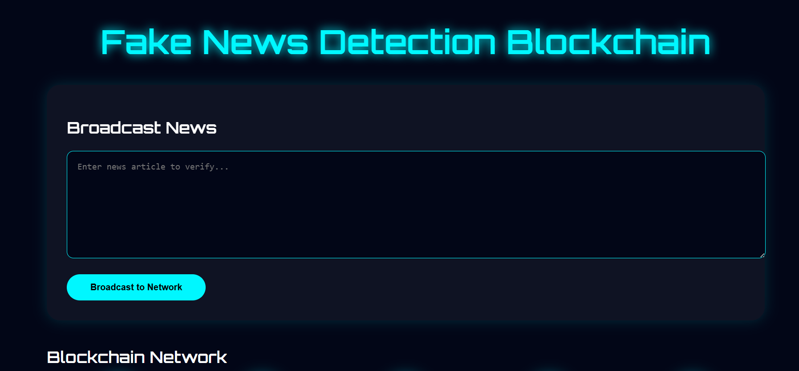
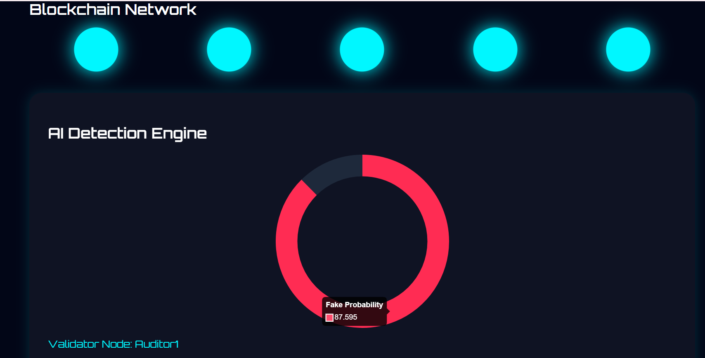
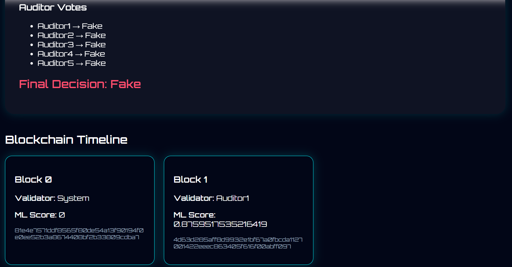

# Fake News Detection using Blockchain and Machine Learning

This project presents a blockchain-based framework for detecting and verifying fake news using a machine learning model and decentralized validation mechanisms. The system integrates Natural Language Processing (NLP) techniques with a blockchain-inspired architecture to improve transparency, trust, and accountability in news verification.

The platform allows users to submit news articles for analysis. A trained machine learning model evaluates the authenticity of the content and generates a probability score indicating the likelihood that the news is fake. The result is then validated by a network of auditors whose votes are recorded and stored in a blockchain-like ledger. Each validated news item is stored as a block, ensuring data integrity and traceability.

## Features

* Machine learning based fake news classification using NLP techniques
* Blockchain-style ledger for storing validated news records
* Proof-of-Stake inspired validator selection mechanism
* Auditor voting system for decentralized verification
* Reputation system to evaluate auditor reliability
* Interactive web dashboard for user interaction and visualization
* Probability visualization using a dynamic gauge chart

## System Architecture

The system consists of three primary components:

### Machine Learning Layer

A supervised machine learning model trained on a dataset containing fake and real news articles. The model processes submitted news content and outputs a probability score indicating the likelihood of misinformation.

### Blockchain Layer

Validated news entries are stored as blocks in a blockchain-like data structure. Each block contains:

* News content
* Machine learning probability score
* Validator information
* Auditor votes
* Hash of the previous block

This structure ensures data integrity and prevents tampering with previously verified records.

### Auditor Network

A group of auditors reviews the machine learning output and votes on the authenticity of the news. A reputation mechanism tracks auditor reliability, and validator nodes are selected based on a Proof-of-Stake inspired selection process.

## System Workflow

1. A user submits a news article through the web interface.
2. The machine learning model evaluates the article and generates a fake news probability score.
3. Auditors review the prediction and cast their votes regarding the authenticity of the content.
4. A validator is selected using a reputation-based selection mechanism.
5. A new block is created containing the news record and validation information.
6. The block is appended to the blockchain ledger, making the record immutable and transparent.

## Technologies Used

* Python
* Flask
* Scikit-learn
* Natural Language Processing (NLP)
* Blockchain data structures
* HTML and CSS
* Chart.js

## Project Structure

```
fake-news-blockchain
│
app.py
blockchain.py
auditor.py
consensus.py
reputation.py
ml_model.py
requirements.txt
.gitignore
README.md
│
dataset/
templates/
static/
```

## Installation

Clone the repository:

```
git clone https://github.com/Priyanshi0275/fake-news-blockchain.git
```

Navigate to the project directory:

```
cd fake-news-blockchain
```

Install the required dependencies:

```
pip install -r requirements.txt
```

Run the application:

```
python app.py
```

Open the application in a browser:

```
http://127.0.0.1:5000
```

## Dataset

The machine learning model is trained using a dataset containing fake and real news articles. The dataset includes labeled examples used to train and evaluate the NLP classifier.
Dataset used: Kaggle Fake and Real News Dataset
https://www.kaggle.com/datasets/clmentbisaillon/fake-and-real-news-dataset
## Application Interface

### Dashboard



### AI Probability Detection



### Blockchain Timeline



## Author

Priyanshi Mishra
